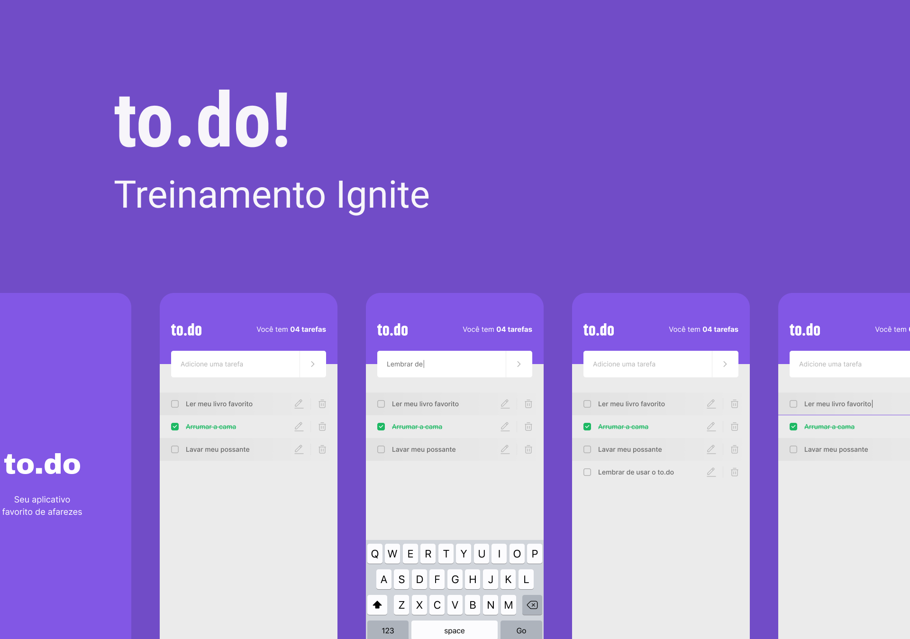
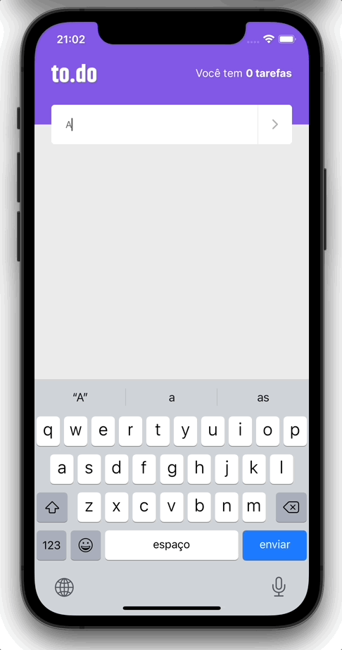

<h1 align="center">
  
</h1>

<p align="center">Um simples app de afazeres desenvolvido em React Native como parte do desafio do <a href="https://www.rocketseat.com.br/ignite">Ignite da Rocketseat</a>.</p>

<p align="center">
  
</p>

## 🚀 Rodando o projeto

Caso queira baixar o projeto e rodar localmente em seu computador, siga os seguintes passos:

1. **Certifique-se de que tem os _softwares_ necessários:**

   Para rodar o projeto é necessário que tenha o ambiente configurado com o Node e Android SDK ou Xcode. [Aqui](https://react-native.rocketseat.dev/) você pode encontrar instruções para configurar o ambiente caso ainda não tenha feito.

2. **Clone o repositório:**

   No terminal, navegue para a pasta onde deseja salvar o código fonte e baixe utilizando o seguinte comando:

    ```sh
      git clone https://github.com/allanmaral/to.do.git
    ```

3. **Instalando as dependências:**

   Para instalar as dependências, basta rodar:

   ```sh
    cd to.do
    yarn
   ```

   Caso esteja rodando o projeto no iOS será necessário instalar as dependências do projeto do Xcode, para isso é só rodar:

   ```sh
   cd ios
   pod install
   cd ..
   ```

4. **Rodando localmente:**

   Com as dependências já instaladas, para iniciar o app, execute:

   ```sh
     yarn ios
     # ou
     yarn android
   ```

   O emulador deve abrir com o App!
